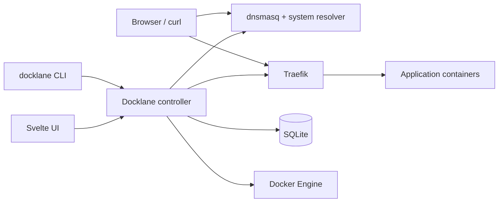

The controller is the source of route intent and observed state. Traefik owns
the live HTTP data plane. Docker and host configuration are privileged external
systems reconciled through explicit plans and ownership records.

The UI is compiled into the Go binary, so the controller and interface ship as
one versioned artifact.
