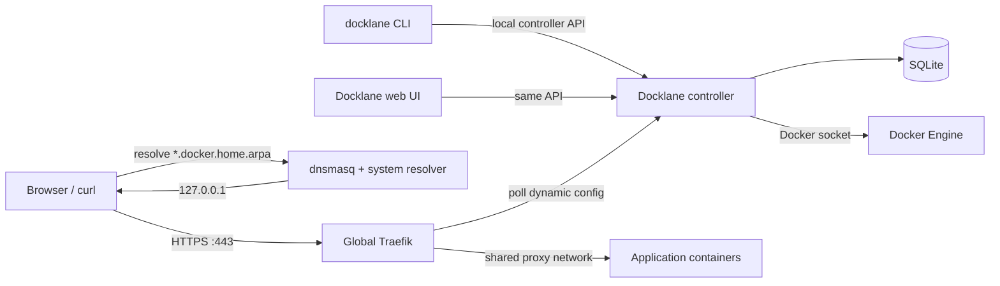
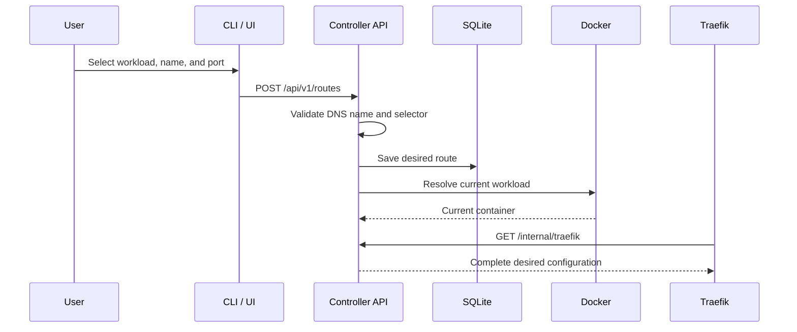

# Docklane Architecture

## 1. Purpose

Docklane is a local container gateway. It gives Docker workloads stable HTTPS
names such as:

```text
https://excalidraw.docker.home.arpa
```

Application containers expose ports only inside Docker networks. Traefik is
the only process that publishes host ports 80 and 443.

Docklane manages the control plane around this arrangement:

- discover running workloads;
- save a route from a local hostname to a workload and internal port;
- reconcile routes when Compose recreates containers;
- generate Traefik dynamic configuration;
- eventually manage the shared proxy network, local DNS, and local TLS trust;
- expose the same operations through a CLI, API, and web UI.

## 2. Goals and non-goals

### Goals

- Replace remembered host port numbers with predictable local HTTPS names.
- Avoid host-port conflicts between application containers.
- Keep routes stable across container recreation.
- Provide friendly web UX and scriptable CLI DX over one controller API.
- Make every machine-level change explicit, inspectable, and reversible.
- Work entirely on a local machine without purchased domains or public DNS.
- Detect failures across DNS, TLS, Traefik, Docker networking, and the app.

### Non-goals for the first release

- Public internet ingress or ACME certificates.
- Kubernetes or remote Docker hosts.
- Raw TCP and UDP routing.
- Multi-user authorization or remote administration.
- Editing application Compose files automatically.
- Replacing Docker Compose.

## 3. Architectural principles

1. Application containers do not publish HTTP ports to the host.
2. Only the global Traefik instance binds host ports 80 and 443.
3. Routes identify Compose workloads, not ephemeral container IDs.
4. DNS and TLS use one namespace: `*.docker.home.arpa`.
5. The CLI and web UI call the same controller API.
6. Docklane produces a complete desired Traefik configuration, not label
   fragments distributed across application Compose files.
7. Reconciliation is idempotent: running it repeatedly produces the same
   result.
8. Docklane never removes a network attachment or system configuration it did
   not create.
9. Unsafe or machine-level operations support preview and rollback.
10. An unresolved route is omitted and reported as unhealthy; Docklane never
    guesses an upstream.

## 4. System context



Docklane has a control plane and a request data plane:

- The **control plane** is the CLI/UI → controller → SQLite/Docker/Traefik
  configuration path.
- The **data plane** is the browser → Traefik → application path. Application
  traffic does not pass through the Docklane controller.

Diagnostics deliberately span both perspectives. The controller reports
desired routes and observed Docker/network state. The CLI performs DNS, TCP,
TLS, redirect, and HTTPS probes from the user's machine, matching the browser's
resolver and trust store. Diagnostic commands use only GET APIs and network
probes; repair remains a separate, explicitly mutating workflow.
The controller also reads Traefik's authenticated API over the private control
network and returns only route-scoped provider, router, service, and backend
status. Dashboard credentials and raw runtime configuration never cross the
Docklane administration API.
The UI consumes a controller-only diagnostic report and runs a separate
browser `no-cors` HTTPS probe. A successful browser probe means DNS, connection,
and certificate acceptance succeeded in that browser; it does not claim access
to the opaque HTTP response status. The UI labels both perspectives instead of
merging them into a misleading single probe.
Route availability is stricter than Docker reconciliation. A saved route moves
through `reconciling`, `publishing`, and `verifying`; it is user-clickable only
after Traefik reports the exact router and service enabled with at least one
`UP` backend. The UI polls this route-scoped readiness for up to 30 seconds and
then directs the user to diagnostics instead of exposing Traefik's unmatched
router 404 during provider propagation.
Network aliases are hydrated only when diagnostics explicitly request them;
ordinary UI discovery does not perform per-container Docker inspect calls.

## 5. Components

### 5.1 Controller

The controller is a single Go process responsible for:

- serving the REST API and embedded Svelte UI;
- reading and validating desired routes from SQLite;
- discovering Docker containers and Compose labels;
- resolving stable workload selectors to current container instances;
- reconciling managed proxy-network attachments;
- rendering and validating a complete Traefik HTTP-provider document;
- persisting the last validated provider document for restart recovery;
- reporting route health and diagnostics.

The default development listener is `127.0.0.1:4646`. The integrated
deployment must expose the provider endpoint to Traefik on a private Docker
network while keeping administration local to the host.

### 5.2 CLI

The Go CLI is part of the same binary as the controller. It is intended for:

- discovery and route management;
- automation through `--json`;
- safe previews through `--dry-run`;
- installation, migration, rollback, and diagnostics.

The current prototype uses a loopback HTTP API. A Unix socket is the preferred
final local administration transport because it avoids opening another host
TCP listener and supports filesystem permissions.

### 5.3 Web UI

The Svelte UI is compiled to static assets and embedded in the Go binary. It:

- discovers running containers;
- displays saved local routes;
- guides selection of an internal container port;
- shows the equivalent CLI command for important operations.

The UI is a client of the controller API. It does not contain a second
implementation of route or Docker logic.

### 5.4 Persistence

SQLite stores Docklane-owned desired state. The initial route model is:

| Field | Purpose |
| --- | --- |
| `id` | Stable Docklane identity |
| `revision` | Monotonic version used to reject stale updates |
| `name` | DNS label below the configured base domain |
| `compose_project` | Stable Compose project selector |
| `compose_service` | Stable Compose service selector |
| `container_id` | Fallback for non-Compose containers |
| `port` | Internal upstream TCP port |
| `scheme` | Upstream `http` or `https` |
| `enabled` | Whether the route should be published |
| `created_at`, `updated_at` | Audit timestamps |

The `network_attachments` table is an ownership ledger keyed by container ID
and network name. A row means Docklane performed that exact connection and may
later undo it. Absence of a row means the attachment is external state and
must be preserved.

The `health_snapshots` table stores controller-perspective diagnostic reports,
keyed by route and timestamp. Manual diagnoses create a snapshot immediately;
the controller also samples enabled routes every five minutes. Each insert
prunes older rows beyond the configured per-route cap, which defaults to 288
(approximately 24 hours at the periodic cadence). Deleting a route deletes its
history in the same transaction. Browser probe results are intentionally not
persisted.

SQLite is not in the application request path. Database loss affects route
management and future reconciliation, not traffic already being handled by
Traefik.

Schema changes are ordered by `PRAGMA user_version` and applied one migration
per transaction. Before changing an existing database, Docklane creates a
consistent SQLite snapshot under `data/backups/` with mode `0600`. Databases
from the pre-versioning prototype are recognized from their route-table shape,
backed up, and stamped without replaying changes they already contain.
Docklane refuses to open a schema newer than the binary supports.

Machine-level installation ownership is intentionally stored outside SQLite
in a standalone, versioned, mode-`0600` JSON manifest. Installation and
rollback must remain possible before the controller database exists and after
the controller has stopped. Manifest writes use generation checks, an advisory
lock, atomic replacement, file and directory sync, strict JSON decoding, and
explicit managed-versus-adopted rollback rules. Schema v1 is documented in
[install-manifest-v1.md](./install-manifest-v1.md).

### 5.5 Docker adapter

The Docker adapter discovers:

- container ID and current name;
- running state and health status;
- Compose project and service labels;
- declared private TCP ports;
- network membership.

The integrated implementation connects enabled workloads to the configured
proxy network and leaves every existing network intact. After a successful
connect, it records ownership in SQLite. When no ready Docklane route needs
that container, reconciliation disconnects only a recorded attachment and
removes the record. A missing container only clears its stale ownership row;
pre-existing network membership is never disconnected.

The configured network name is authoritative. Docklane classifies it as
missing, managed, compatible external, or conflicting. It never adds ownership
labels to an existing network. An explicitly created network uses the local
bridge driver and these labels:

```text
com.docklane.managed=true
com.docklane.role=proxy
com.docklane.schema=1
```

The active machine's existing `proxy` network is intentionally classified as
external. A missing network is created only through a reviewed
`network plan` → `network apply` operation; periodic reconciliation never
silently creates machine-level infrastructure.

Docker socket access is effectively root-level authority and is treated as the
primary security boundary; mounting the socket path read-only does not make
Docker API operations read-only.

### 5.6 Traefik adapter

Traefik polls a Docklane endpoint such as:

```text
GET /internal/traefik
```

The endpoint returns a complete dynamic HTTP configuration containing routers
and services. A route resembles:

```text
Host(`excalidraw.docker.home.arpa`)
    -> service excalidraw
    -> http://docklane-route-42:80
```

Every route derives a deterministic network alias from its durable database
identity, such as `docklane-route-42`. When several routes target one
container, Docklane connects the endpoint with the complete alias set and each
Traefik service uses its own alias.

After Compose recreates a workload, its stable project/service selector
resolves the new container and reconciliation attaches that instance with the
same aliases. If a Docklane-owned endpoint is missing an expected alias,
Docklane repairs it with a disconnect/reconnect operation and attempts to
restore the previous aliases if reconnection fails.

Docker cannot modify aliases on an existing endpoint in place. Docklane
therefore never performs alias repair on a pre-existing attachment it does not
own; those routes safely continue using the current container name until the
network is explicitly adopted or recreated under Docklane management.

### 5.7 DNS

The local namespace is `docker.home.arpa`. `home.arpa` is intended for local
home-network naming and avoids pretending that a purchased public domain
exists.

The target dnsmasq rule is:

```ini
address=/.docker.home.arpa/127.0.0.1
local=/docker.home.arpa/
```

The system resolver must route `docker.home.arpa` queries to dnsmasq without
requiring DNS-over-TLS on the loopback resolver. Docklane must detect the
machine's resolver manager before applying a system integration.
The `local=` declaration is part of the correctness contract: `address=`
provides the IPv4 answer, while declaring the zone local prevents AAAA and
other record types from being forwarded to systemd-resolved and routed back
to dnsmasq in a loop.

### 5.8 Local TLS

Docklane uses a locally trusted root CA and a leaf certificate with these SANs:

```text
docker.home.arpa
*.docker.home.arpa
```

The wildcard covers exactly one label, for example
`excalidraw.docker.home.arpa`. It does not cover
`api.excalidraw.docker.home.arpa`.

The private CA key and leaf key require restrictive host permissions. Trust
installation must be explicit and have a recorded rollback action. Browser
trust stores that do not use the system trust store must be handled separately.

### 5.9 Installation preflight

`docklane preflight` is a read-only compatibility inspection. It binds and
immediately releases ports 80 and 443 to distinguish free gateway ports from
active listeners, then correlates occupied ports with the exact published
ports of one detected Traefik container. It never assumes that an unrelated
listener belongs to Traefik merely because a Traefik container also exists.

Preflight also verifies Docker socket access, proxy-network compatibility,
dnsmasq installation/service/include configuration, every readable wildcard
mapping for the base domain, the system resolver's actual wildcard answer, and
the installation manifest. For an existing Traefik candidate, it inspects the
container command and read-only mounts to locate the dynamic TLS configuration,
maps its certificate and key back to host paths, and verifies:

- explicit base-domain and wildcard SAN coverage plus the validity window;
- owner-only private-key permissions and certificate/key correspondence;
- that the configured host trust anchor issued the leaf certificate; and
- that the certificate served on port 443 has the inventoried fingerprint.

Preflight identifies the Docklane runtime only through its exact Compose
project/service ownership and then inspects both containers. Adoption requires
one healthy controller and one healthy probe built from the same immutable
image. The controller must publish `4646` to loopback only, run on the private
control network, use a read-only root filesystem, and mount Docker and Traefik
credentials read-only. The probe must run only on the proxy network, publish no
port, have no Docker socket, and drop all Linux capabilities. The shared socket
volume, control network, and controller data directory are inventoried as
separate ownership resources.

Existing compatible infrastructure is reported as an adoption candidate;
missing state is a warning for the future install plan; ambiguous ownership or
conflicting DNS, network, TLS, or runtime state blocks installation. Checks
have stable IDs and support JSON output for the deterministic
`install --dry-run` planner.

`docklane install --dry-run` converts structured preflight inventory—not
human-readable summaries—into validated manifest resources and ordered
operations. Existing compatible resources can only become adopted/preserved;
missing resources become managed with remove or restore rollback. A SHA-256
token covers the target, inventory, resources, operations, blockers, and
pending coverage while excluding observation time, so unchanged machine state
produces the same review token. A verified existing certificate, private key,
trust anchor, controller image, and probe image are fingerprinted. Containers,
networks, volumes, and the data directory are independently recorded as
adopted/preserved or managed/removable; failure at any ownership boundary
prevents adoption.

Any plan containing a managed resource must include installation specification
schema v1. It pins canonical state/data/PKI/Traefik paths, image references,
certificate SAN and lifetime policy, Docker networks and volume names, and
three complete container roles. Validation rejects `/` as a state root,
requires every mutable PKI/runtime path below the dedicated state directory,
limits leaf validity to 397 days, requires RSA keys of at least 3072 bits, and
enforces the gateway ports, loopback controller port, and capability-free
probe. Pure adoption plans omit the managed specification because their exact
external resources are already recorded by inventory.

Managed plans also carry a deterministic artifact bundle derived solely from
that specification. Rendered dnsmasq and Traefik configuration and normalized
container specifications include their SHA-256 fingerprints, so a reviewed
token commits to their exact bytes. Private keys, certificates, and dashboard
credentials are represented only by target, mode, sensitivity, and
`generatedAtApply`; their values never enter dry-run output.

The PKI generator operates in memory. It creates separate 3072-bit RSA root
and leaf keys, a self-signed CA, and a server certificate whose SAN extension
explicitly contains both the base domain and its wildcard. Before any future
writer may stage these bytes, the leaf is verified against the new root for
both the apex and a representative subdomain. This separates reproducible
review input from intentionally random apply-time material.

Materialization expands those descriptors into ten files in memory: three
rendered configurations, five PKI/trust files, and two dashboard credential
files. The rendered host configuration includes the dnsmasq wildcard rule and
an exact systemd-resolved route-only domain drop-in. The password is a
URL-safe encoding of 256 random bits. Only its bcrypt
hash enters Traefik's users file; the raw password is confined to the
controller's mode-`0600` secret file. Sensitive buffers have an explicit
clearing path after staging.

The managed file stager is a reversible transaction rather than a collection
of direct writes. It validates every target before mutation, rejects symbolic
links and non-regular replacement targets, constrains sensitive modes, and
caps file sizes. Every replacement first receives a private, fingerprinted
backup preserving its original mode. New content follows:

```text
temporary file → write → chmod → fsync(file) → rename → fsync(directory)
```

If a later write fails, completed writes are walked in reverse: created files
are removed and replaced files are restored only after their backup
fingerprint is revalidated. Rollback also requires the current target's
fingerprint and mode to still match the staged result, preventing it from
overwriting an external edit. Backup corruption or target drift stops that
step, preserves the backup, and permits a retry after the conflict is repaired.
The install command connects this executor only after private material has
been durably cached and the complete operation topology has been validated.

The file composition adapter makes each of the ten materialized files an
explicit managed resource. Resolver configuration has a separate
`resolver-config` file resource from the behavioral `resolver-domain`
resource. Root and leaf keys/certificates, the trust anchor, Traefik dynamic
configuration, dashboard password/users file, dnsmasq mapping, and resolver
drop-in therefore all have their own ownership and rollback records.

Before a file step can mutate disk, its exact content fingerprint and mode are
part of the immutable execution topology. Backups use a deterministic private
directory per resource. Inspection compares both content and mode, reconstructs
an interrupted apply from the target and backup, and distinguishes newly
created files from replacements. A `remove` contract refuses any pre-existing
target; a `restore` contract refuses an absent target. Retry cleans interrupted
backup preparation only after the target is proven to still equal the original
snapshot. Rollback refuses target, type, mode, content, or backup drift.

Sensitive material is cloned into the adapter, and its caller explicitly
clears that clone at the terminal boundary. A restarted workflow must
rehydrate the exact same bytes: the journal rejects a changed fingerprint
before another file is touched.

Managed parent directories are explicit resources rather than side effects of
file creation. The plan records the Traefik, dynamic configuration,
certificate, PKI, secret, and backup directories independently. Each new
directory is published with a private Docklane ownership marker by an atomic
no-replace rename, so an unmarked pre-existing path is a conflict instead of
being silently adopted. Inspection binds the marker fingerprint and mode into
the execution journal and can reconstruct publication after a crash.

Directory rollback removes the ownership marker and then the directory only
when no other entries remain. It refuses symbolic links, wrong ownership,
changed modes or markers, and non-empty directories. Recovery also handles a
crash between marker removal and directory removal. Nested directories are
created parent-first and removed child-first.

The managed workflow composer enforces one complete operation for every
managed resource and this stage order:

```text
directories → files → host activation → Docker runtime → verification
```

Files below a managed directory tree require their direct parent to be an
explicit directory step. Rollback uses the exact reverse order, ensuring files
and runtime consumers are removed before their directories. Host rollback
restores the journaled file steps before refreshing trust or services; the
later file-stage rollback checkpoints then reconcile those already-restored
targets. Directory, cached-file, host, and Docker adapters are integration
tested through this composition boundary and used by managed install.

The private material cache now provides that rehydration boundary. Before any
target file step, selected materialization is published atomically under:

```text
STATE/.material-cache/INSTALLATION_ID/
```

Every cached payload and its strict JSON descriptor use mode `0600`; the cache
directories use `0700`. State, cache, staging, lock, descriptor, and payload
ownership must match the effective installer user. The descriptor contains
only artifact IDs, final targets, intended modes, sensitivity flags, and
SHA-256 fingerprints. It contains no certificate keys, passwords, or rendered
content. Its inventory fingerprint and installation-bound absolute paths are
then saved into the installation manifest before execution journaling begins.

Cache publication uses a private deterministic staging directory, file fsync,
directory fsync, atomic directory rename, and parent fsync under an exclusive
per-installation lock. A cache published before a failed manifest checkpoint
is recognized and reused on restart without regenerating secrets. Partial
staging is replaceable only before an execution journal exists. Reload rejects
unknown entries, symlinks, non-regular files, broad permissions, wrong
ownership, changed fingerprints, a changed artifact selection, or a different
installation path.

Terminal cleanup is also journaled:

```text
ready → clearing → cleared
```

The `clearing` checkpoint is durable before any payload is unlinked. Cleanup
removes only the exact fingerprinted entries and descriptor; unknown or
modified entries stop deletion. If the process exits after removal but before
the `cleared` checkpoint, restart observes the absent directory and safely
finishes the manifest transition.

Hybrid plans select artifacts by resource ownership. An adopted DNS, resolver,
TLS, gateway, or runtime component never receives its managed replacement
artifact merely because some other component requires creation. Selected
materialization also avoids generating PKI or credentials when the plan needs
only container specifications.

Managed Docker execution follows a separate reversible transaction. The
installation specification expands into strict Engine API requests in this
dependency order:

```text
proxy network → private control network → probe socket volume
              → probe → controller → gateway
```

The control network is internal, the probe is capability-free, the controller
publishes only its loopback port, and the gateway alone publishes 80/443.
Every resource is labeled with the managed schema, role, and immutable
installation ID. The installation-ID label closes Docker's named-volume race:
volume creation may return an already-existing name, but that object cannot
be deleted by this transaction unless its ownership label matches.

Each create is followed by inspection. Networks verify driver, scope,
internal/attachable state, and ownership. Volumes verify driver, scope, and
ownership. Containers verify image reference, command, network set, mounts,
published ports, read-only root filesystem, privilege state, security options,
capability drops, restart policy, and labels both before and after startup.
Rollback walks the graph in reverse, re-inspects the exact returned ID, and
removes it only if its configuration and ownership still match the recorded
post-create snapshot. Running and health are treated as volatile; topology and
ownership drift stop deletion and permit a later retry.

Host integration composes around the reversible file transaction:

```text
snapshot services
  → validate dnsmasq
  → refresh the selected system trust store and verify the CA
  → start/restart dnsmasq
  → start/restart systemd-resolved
  → flush resolver caches
  → verify apex and wildcard DNS resolve only to 127.0.0.1
```

The managed specification pins a platform profile, its trust-store profile,
the `systemd-resolved` profile, both service names, and the exact resolver
drop-in target. `arch-systemd` uses p11-kit; `debian-systemd` uses
`update-ca-certificates` and `/etc/ssl/certs/ca-certificates.crt`. The dnsmasq
artifact binds explicitly to `127.0.0.1` so it can coexist with
systemd-resolved's `127.0.0.53` stub and declares the managed zone local to
prevent resolver loops. The drop-in routes only
`~docker.home.arpa` to loopback dnsmasq. Preflight inventories the real
`/etc/resolv.conf` symlink target. If it points at systemd-resolved's uplink
file, Docklane journals an atomic exchange to
`/run/systemd/resolve/stub-resolv.conf`; apply and rollback both refuse an
unreviewed target, and uninstall restores the exact prior link.

Docker 20.10 cannot create a container with multiple network endpoints in one
request, so Docklane creates it on the first network and attaches remaining
networks before startup. The controller joins the private control network and
Docker's built-in bridge: Traefik polls it over the private network, while the
non-internal bridge permits Docker to publish the controller API solely on
`127.0.0.1:4646`.

Rollback first compares current
service state with the recorded post-apply state; drift stops rollback before
files change. It then restores the file transaction, refreshes trust, validates
the restored dnsmasq configuration, and restores resolver then dnsmasq to their
exact prior active/inactive states. A failed file restore prevents any service
reload, and partial rollback steps remain retryable.

Managed transaction composition uses an optional schema-v1 execution journal
inside the installation manifest. Each managed resource has exactly one
ordered operation recording its stage, target, attempt count, external
observation, and one of:

```text
pending → applying → applied → rolling_back → rolled_back
                         ↘ failed ↗
```

`applying` and `rolling_back` are persisted before calling an external
executor. If the process stops after the external mutation but before the next
manifest generation is saved, recovery inspects the target against the
journaled contract. It advances an already-completed step, retries only when
inspection proves the mutation absent, and records a conflict without further
mutation when ownership or configuration drift is observed. Rollback walks the
same immutable operation list in reverse. The operation list must match the
recovering workflow exactly, preventing a changed binary or specification from
guessing how to resume old state.

The composition coordinator and its crash-window recovery are implemented for
managed directories, files, host services/resolver behavior, Docker networks,
the shared volume, and all three containers. Docker observations bind exact
Engine IDs and normalized inspected-state fingerprints. Host observations bind
the service state captured by the reviewed preflight, avoiding ambiguity when
a restart does not change an already-active service.

For a new installation, `docklane install --token TOKEN` reruns preflight and
reconstructs the plan. A constant-time exact comparison binds apply to the
machine state the user reviewed. The reviewed token is then persisted in the
private manifest before mutation. If an incomplete managed manifest already
exists, the same command requires that original token and resumes from its
material-cache and execution checkpoints without rebuilding a plan from
changed ambient state.

The adoption executor refuses incomplete, blocked, stale, or mutating plans.
For a valid adoption it atomically writes manifest generations in this order:

```text
planned → applying → installed
                   ↘ failed
```

Every adopted resource is already `verified` and uses `preserve`; therefore
this path changes no running infrastructure and has nothing destructive to
roll back. Managed install materializes its private cache, composes every
managed resource exactly once, runs the durable workflow, and clears generated
PKI/password payloads only after an installed, rolled-back, or failed terminal
checkpoint. A finalization error is journaled as `failed`.

`docklane uninstall --dry-run` is generated only from a valid installed
manifest, never from live-state guesses. Resources are traversed in reverse
installation order so consumers precede their networks, volumes, directories,
and gateway dependencies. Adopted resources emit non-mutating `preserve`
operations. Managed `remove` resources emit removal operations, while managed
file `restore` resources require the exact backup path and fingerprint already
validated by manifest schema v1. Service restore resources use their recorded
prior-state snapshot. The uninstall token covers the installation identity,
manifest generation, path, operations, and blockers.

`docklane uninstall --token TOKEN` persists that token before the first
mutation and drives the installed execution journal in reverse. It reconstructs
file rollback from intent fingerprints, modes, and backups without regenerating
deleted secrets; host rollback still restores files before trust/service
reload; Docker removal requires the recorded Engine identity. The same token
resumes an interrupted rollback, including external success followed by a lost
checkpoint. Adopted resources are never included in mutation steps.

The controller data directory has an explicit retention boundary: if empty it
is removed, but if the controller produced persistent data, uninstall removes
only Docklane's ownership marker and leaves the contents in place. A
`rolled_back` mode-`0600` manifest is retained as an audit tombstone instead of
being deleted during the transaction that proves recovery.

## 6. Route lifecycle

### 6.1 Create



### 6.2 Reconcile after recreation

```text
stored Compose project/service selector
                    │
                    ▼
discover current running container
                    │
                    ▼
ensure owned proxy attachment + deterministic route aliases
                    │
                    ▼
render current Traefik upstream
```

Container recreation changes the instance but not the stored selector or local
hostname. Reconciliation repairs the runtime binding without requiring
application labels or a Traefik restart.

Docklane subscribes to Docker container lifecycle and health events for the
fast path. Compose recreation emits several events, so the controller
coalesces each burst before rediscovery. The event stream reconnects after an
interruption, while periodic reconciliation remains the authoritative recovery
path for missed events.

### 6.3 Delete and rollback

Deleting a route removes it from desired Traefik configuration. If Docklane
attached the workload to the managed proxy network, it may detach that
attachment only after confirming no other Docklane route still needs it.

Docklane does not stop the application container, remove its Compose network,
or edit its Compose file.

### 6.4 Application opt-in commands

`docklane app enable TARGET` composes discovery, route desired state,
ownership-tracked attachment, and route readiness into one idempotent
operation. Targets may be stable `project/service` identities, unique Compose
services, container names, or unambiguous ID prefixes. A Compose selector is
stored whenever available so container recreation does not change the route.
Port inference succeeds only when the container declares exactly one TCP port;
ambiguous ports require an explicit choice.

The command refuses to retarget an existing local name, re-enables an
identical disabled route, and waits for the route-scoped Traefik readiness
contract before reporting the HTTPS URL as ready. `docklane app disable`
changes desired route state but relies on the existing ownership ledger for
cleanup: externally attached endpoints remain untouched, and owned endpoints
remain while another enabled route needs them.

`docklane app guide` is read-only. It prints the equivalent enable command and
an `expose` fragment only when the selected port is not already declared. It
does not write Compose files, add Traefik labels, publish a host port, or attach
the container itself.

### 6.5 Concurrent updates

Every stored route has a revision beginning at 1. A client reads that revision
with the route and must return it in `PUT /api/v1/routes/{id}`. SQLite updates
the route only when the submitted revision still matches, then increments it
atomically. A stale write receives HTTP 409 and must refresh before retrying;
Docklane never silently overwrites the newer desired state.

## 7. Reconciliation and failure behavior

The controller computes observed state from Docker and compares it with desired
state from SQLite.

| Condition | Behavior |
| --- | --- |
| Exactly one running workload matches | Publish the route |
| No running workload matches | Omit route and report `unresolved` |
| Multiple workloads match unexpectedly | Omit route and report `ambiguous` |
| Selected port is no longer declared | Omit route and report actionable `error` |
| Route targets the active Traefik gateway | Reject or omit it to prevent a self-routing loop |
| Enabled Docker-label router claims the same hostname | Reject enable/create, or omit an existing route and report the conflicting router and container |
| Managed network is missing | Preview creation and create only through explicit `network apply` |
| Existing network has compatible external ownership | Use it without adding or claiming labels |
| Existing network has conflicting Docklane labels or driver | Refuse apply without mutation |
| Workload is outside the proxy network | Attach it when enabled, record ownership, and publish after membership is observed |
| Owned attachment lacks a route alias | Reconnect it with the complete desired alias set and roll back on failure |
| Pre-existing attachment lacks a route alias | Preserve it and use the current container name |
| Docklane-owned attachment is no longer needed | Disconnect it and remove the ownership record |
| Pre-existing proxy attachment is no longer routed | Preserve it because Docklane does not own it |
| Traefik cannot fetch Docklane | Traefik retains its last successful HTTP-provider configuration in memory |
| Docklane cannot render live state | Serve the persisted, revalidated last-known-good document and report degraded health |
| No live document or valid snapshot exists | Return HTTP 502 and report provider source `unavailable` |
| DNS or certificate is wrong | `doctor` identifies the failed layer |

Docklane treats Docker-declared private TCP ports as the safe publication
boundary. A resolved workload with a different configured port remains saved
as desired state, reports the ports that are available, and is excluded from
the provider document. This lets a corrected container image recover on a
later reconciliation without losing the user's route.

An active reachability probe remains separate from declared-port validation.
It must run from the same network perspective as Traefik; attaching the
controller to every application network merely to probe would weaken the
private control-plane boundary.

The active Traefik gateway is also not an application target. Docklane
classifies the official Traefik container that publishes host port 80 or 443
as a managed system container. The API rejects new active routes to it, legacy
routes are excluded from provider output with an actionable error, and the UI
does not offer the normal create-route action. Traefik's dashboard is a
special system route backed by `api@internal`, not by proxying to the
gateway's own port 80 or 443.

Docklane treats an exact `Host(...)` rule on a running container with
`traefik.enable=true` as an active hostname claim. An enabled Docklane route
cannot claim the same hostname. Existing routes are rechecked during periodic
and event-driven reconciliation, so a conflicting label added later changes
the route to `error` and removes it from HTTP-provider output. Disabled routes
may retain the hostname, which supports a migration sequence of creating a
shadow route, removing the old Docker labels, and then enabling Docklane.
`HostRegexp(...)` rules are not treated as exact claims.

The integrated implementation uses two complementary recovery layers. Traefik
keeps its last successful HTTP-provider configuration in memory when a poll
times out or the Docklane container is unavailable. Docklane also stores each
changed, fully validated provider document and its SHA-256 fingerprint in
SQLite. If a live desired-state read, reconciliation, Docker discovery,
rendering, or validation fails, Docklane verifies the snapshot fingerprint,
revalidates its structure, and serves it with HTTP 200. Health then exposes
`provider.source=last-known-good` plus the live error. If neither source is
valid, the provider returns HTTP 502 instead of publishing partial
configuration.

A parallel Traefik file-provider copy is intentionally not used: after HTTP
recovery, file and HTTP providers would both define the same routers and
services. The remaining availability boundary is a simultaneous Traefik
restart while Docklane cannot start or serve its SQLite snapshot. Recovery in
that case is to restore Docklane first, confirm a successful provider response,
and then let Traefik poll it.

## 8. API boundary

Current endpoints:

| Method | Path | Purpose |
| --- | --- | --- |
| `GET` | `/api/v1/health` | Controller health and base domain |
| `GET` | `/api/v1/containers` | Discover running containers |
| `GET` | `/api/v1/network/plan` | Read-only create/connect/disconnect preview with a content token |
| `POST` | `/api/v1/network/apply` | Apply only the currently matching reviewed plan |
| `GET` | `/api/v1/routes` | List desired routes |
| `POST` | `/api/v1/routes` | Create a route |
| `GET` | `/api/v1/routes/{id}` | Read a route and its observed state |
| `GET` | `/api/v1/routes/{id}/readiness` | Read controller-to-Traefik activation state for safe link gating |
| `GET` | `/api/v1/routes/{id}/upstream-probe` | Probe the reconciled upstream from the proxy network |
| `GET` | `/api/v1/routes/{id}/traefik-runtime` | Inspect summarized provider/router/service runtime state |
| `GET` | `/api/v1/diagnostics/routes/{id}` | Run read-only controller-perspective route diagnostics |
| `GET` | `/api/v1/diagnostics/routes/{id}/history` | Read bounded controller health snapshots |
| `PUT` | `/api/v1/routes/{id}` | Revision-checked replacement of writable route configuration |
| `DELETE` | `/api/v1/routes/{id}` | Delete a route |
| `GET` | `/internal/traefik` | Full Traefik dynamic configuration |

Planned endpoints add event streaming.
`/internal/*` endpoints are for private component integration, not the public
administration API.

Network plans include every currently expected Docker network operation and a
deterministic token over network state, operations, and warnings. Apply
recomputes the plan and rejects a missing or stale token. This prevents a
reviewed non-destructive plan from turning into an unreviewed disconnect if
Docker or route state changes between preview and apply.

## 9. Security model

Docklane is local-only, but local-only does not mean permission-free.

- The Docker socket grants powerful host control. The controller runs with the
  minimum practical privileges and never exposes that capability remotely.
- Administrative API access is limited to loopback or a Unix socket.
- The Traefik provider endpoint is reachable only on a private Docker network.
- Traefik runtime inspection reuses the authenticated HTTPS dashboard API,
  connects directly over the private control network, and trusts an explicitly
  mounted local CA. Its password is a mode-`0600`, Git-ignored runtime file.
- The upstream probe sidecar joins only the proxy network, has no Docker
  socket or published port, and accepts route-scoped probes only through a
  Unix socket shared with the controller.
- State-changing browser requests require origin/CSRF protection.
- CA private keys are never returned through the API or UI.
- Logs redact secrets and avoid dumping arbitrary container environment values.
- System changes use a preview → apply → verify → rollback transaction model.
- Install records identify exactly which files, trust entries, networks, and
  services Docklane created.

A Docker socket proxy may be added later to restrict the controller to the
small set of Docker Engine operations it needs.

## 10. Deployment model

The intended integrated topology is:

```text
Host
├── dnsmasq
│   └── *.docker.home.arpa -> 127.0.0.1
├── trusted Docklane local CA
└── Docker
    ├── proxy network
    │   ├── traefik        publishes 80/443
    │   ├── docklane-probe no published port or Docker socket
    │   └── selected apps  attached by explicit Docklane operation
    ├── docklane-control network
    │   ├── traefik
    │   └── docklane       private provider/control endpoint
    └── each app's own Compose network remains unchanged
```

The global reverse proxy is installed first. Application projects then opt in
without publishing host HTTP ports or embedding Traefik labels.

## 11. Repository layout

```text
docklane/
├── cmd/docklane/          CLI and controller entry point
├── internal/
│   ├── api/               HTTP administration/provider API
│   ├── client/            CLI API client
│   ├── config/            Runtime configuration
│   ├── docker/            Docker discovery and reconciliation adapter
│   ├── domain/            Route model and validation
│   ├── installmanifest/   Atomic installation ownership manifest
│   ├── store/             SQLite persistence
│   ├── traefik/           Dynamic configuration renderer
│   ├── traefikruntime/    Authenticated Traefik runtime client
│   ├── upstreamprobe/     Restricted proxy-network reachability probe
│   └── webui/             Embedded production UI assets
├── web/                   Svelte source
├── docs/
│   ├── architecture.md    This document
│   ├── install-manifest-v1.md
│   └── plans.md           Phase and task tracker
├── Makefile
└── README.md
```

## 12. Key decisions

| Decision | Reason |
| --- | --- |
| Go controller and CLI | One small native binary, strong concurrency and Docker ecosystem |
| Svelte UI | Compact embedded SPA with little framework overhead |
| SQLite desired-state store | Transactional local persistence without a separate service |
| Traefik HTTP provider | Central route state; no per-app Traefik labels or recreation |
| Compose label selectors | Survive generated name and container ID changes |
| Shared user-defined network | Traefik reaches internal ports without host publication |
| `docker.home.arpa` | Local namespace independent of purchased DNS |
| Local CA + wildcard leaf | Trusted HTTPS for arbitrary one-label app names |
| Explicit apply/rollback | Machine-level DNS, trust, and network changes are recoverable |

Implementation phases and current status are tracked in
[plans.md](./plans.md).
