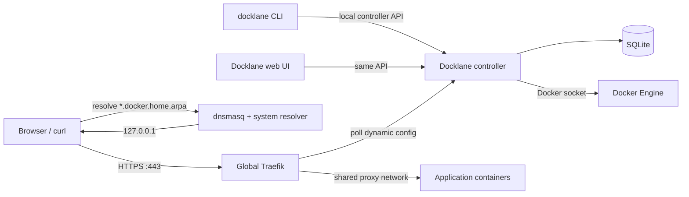
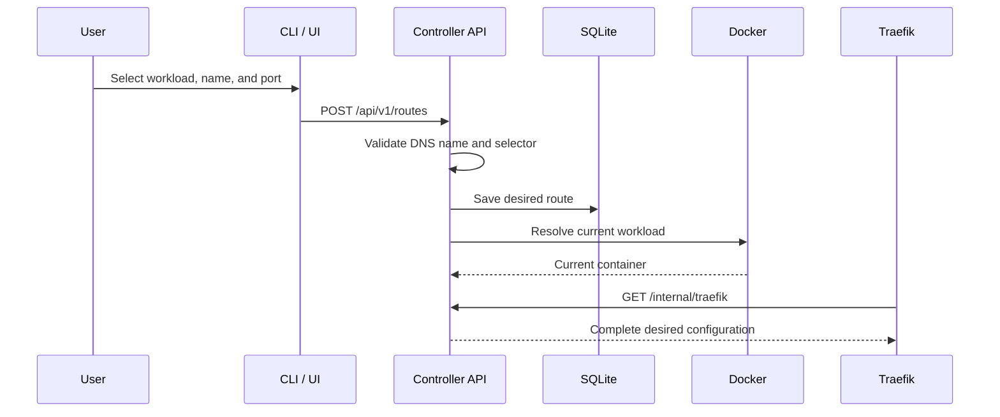

# Docklane Architecture

## 1. Purpose

Docklane is a local container gateway. It gives Docker workloads stable HTTPS
names such as:

```text
https://excalidraw.docker.home.arpa
```

Application containers expose ports only inside Docker networks. Traefik is
the only process that publishes host ports 80 and 443.

Docklane manages the control plane around this arrangement:

- discover running workloads;
- save a route from a local hostname to a workload and internal port;
- reconcile routes when Compose recreates containers;
- generate Traefik dynamic configuration;
- eventually manage the shared proxy network, local DNS, and local TLS trust;
- expose the same operations through a CLI, API, and web UI.

## 2. Goals and non-goals

### Goals

- Replace remembered host port numbers with predictable local HTTPS names.
- Avoid host-port conflicts between application containers.
- Keep routes stable across container recreation.
- Provide friendly web UX and scriptable CLI DX over one controller API.
- Make every machine-level change explicit, inspectable, and reversible.
- Work entirely on a local machine without purchased domains or public DNS.
- Detect failures across DNS, TLS, Traefik, Docker networking, and the app.

### Non-goals for the first release

- Public internet ingress or ACME certificates.
- Kubernetes or remote Docker hosts.
- Raw TCP and UDP routing.
- Multi-user authorization or remote administration.
- Editing application Compose files automatically.
- Replacing Docker Compose.

## 3. Architectural principles

1. Application containers do not publish HTTP ports to the host.
2. Only the global Traefik instance binds host ports 80 and 443.
3. Routes identify Compose workloads, not ephemeral container IDs.
4. DNS and TLS use one namespace: `*.docker.home.arpa`.
5. The CLI and web UI call the same controller API.
6. Docklane produces a complete desired Traefik configuration, not label
   fragments distributed across application Compose files.
7. Reconciliation is idempotent: running it repeatedly produces the same
   result.
8. Docklane never removes a network attachment or system configuration it did
   not create.
9. Unsafe or machine-level operations support preview and rollback.
10. An unresolved route is omitted and reported as unhealthy; Docklane never
    guesses an upstream.

## 4. System context



Docklane has a control plane and a request data plane:

- The **control plane** is the CLI/UI → controller → SQLite/Docker/Traefik
  configuration path.
- The **data plane** is the browser → Traefik → application path. Application
  traffic does not pass through the Docklane controller.

## 5. Components

### 5.1 Controller

The controller is a single Go process responsible for:

- serving the REST API and embedded Svelte UI;
- reading and validating desired routes from SQLite;
- discovering Docker containers and Compose labels;
- resolving stable workload selectors to current container instances;
- reconciling managed proxy-network attachments;
- rendering a complete Traefik HTTP-provider document;
- reporting route health and diagnostics.

The default development listener is `127.0.0.1:4646`. The integrated
deployment must expose the provider endpoint to Traefik on a private Docker
network while keeping administration local to the host.

### 5.2 CLI

The Go CLI is part of the same binary as the controller. It is intended for:

- discovery and route management;
- automation through `--json`;
- safe previews through `--dry-run`;
- installation, migration, rollback, and diagnostics.

The current prototype uses a loopback HTTP API. A Unix socket is the preferred
final local administration transport because it avoids opening another host
TCP listener and supports filesystem permissions.

### 5.3 Web UI

The Svelte UI is compiled to static assets and embedded in the Go binary. It:

- discovers running containers;
- displays saved local routes;
- guides selection of an internal container port;
- shows the equivalent CLI command for important operations.

The UI is a client of the controller API. It does not contain a second
implementation of route or Docker logic.

### 5.4 Persistence

SQLite stores Docklane-owned desired state. The initial route model is:

| Field | Purpose |
| --- | --- |
| `id` | Stable Docklane identity |
| `revision` | Monotonic version used to reject stale updates |
| `name` | DNS label below the configured base domain |
| `compose_project` | Stable Compose project selector |
| `compose_service` | Stable Compose service selector |
| `container_id` | Fallback for non-Compose containers |
| `port` | Internal upstream TCP port |
| `scheme` | Upstream `http` or `https` |
| `enabled` | Whether the route should be published |
| `created_at`, `updated_at` | Audit timestamps |

SQLite is not in the application request path. Database loss affects route
management and future reconciliation, not traffic already being handled by
Traefik.

### 5.5 Docker adapter

The Docker adapter discovers:

- container ID and current name;
- running state and health status;
- Compose project and service labels;
- declared private TCP ports;
- network membership.

The target implementation also performs explicit connect/disconnect operations
for the Docklane-managed proxy network. Docker socket access is effectively
root-level authority and is treated as the primary security boundary.

### 5.6 Traefik adapter

Traefik polls a Docklane endpoint such as:

```text
GET /internal/traefik
```

The endpoint returns a complete dynamic HTTP configuration containing routers
and services. A route resembles:

```text
Host(`excalidraw.docker.home.arpa`)
    -> service excalidraw
    -> http://docklane-route-42:80
```

The target design assigns a deterministic network alias such as
`docklane-route-42` when attaching a container to the managed network. This is
more durable than depending on a generated container name. Phase 1 currently
resolves the route to the current container name and does not attach networks.

### 5.7 DNS

The local namespace is `docker.home.arpa`. `home.arpa` is intended for local
home-network naming and avoids pretending that a purchased public domain
exists.

The target dnsmasq rule is:

```ini
address=/.docker.home.arpa/127.0.0.1
local=/docker.home.arpa/
```

The system resolver must route `docker.home.arpa` queries to dnsmasq without
requiring DNS-over-TLS on the loopback resolver. Docklane must detect the
machine's resolver manager before applying a system integration.

### 5.8 Local TLS

Docklane uses a locally trusted root CA and a leaf certificate with these SANs:

```text
docker.home.arpa
*.docker.home.arpa
```

The wildcard covers exactly one label, for example
`excalidraw.docker.home.arpa`. It does not cover
`api.excalidraw.docker.home.arpa`.

The private CA key and leaf key require restrictive host permissions. Trust
installation must be explicit and have a recorded rollback action. Browser
trust stores that do not use the system trust store must be handled separately.

## 6. Route lifecycle

### 6.1 Create



### 6.2 Reconcile after recreation

```text
stored Compose project/service selector
                    │
                    ▼
discover current running container
                    │
                    ▼
ensure managed network + deterministic alias
                    │
                    ▼
render current Traefik upstream
```

Container recreation changes the instance but not the stored selector or local
hostname. Reconciliation repairs the runtime binding without requiring
application labels or a Traefik restart.

Docklane subscribes to Docker container lifecycle and health events for the
fast path. Compose recreation emits several events, so the controller
coalesces each burst before rediscovery. The event stream reconnects after an
interruption, while periodic reconciliation remains the authoritative recovery
path for missed events.

### 6.3 Delete and rollback

Deleting a route removes it from desired Traefik configuration. If Docklane
attached the workload to the managed proxy network, it may detach that
attachment only after confirming no other Docklane route still needs it.

Docklane does not stop the application container, remove its Compose network,
or edit its Compose file.

### 6.4 Concurrent updates

Every stored route has a revision beginning at 1. A client reads that revision
with the route and must return it in `PUT /api/v1/routes/{id}`. SQLite updates
the route only when the submitted revision still matches, then increments it
atomically. A stale write receives HTTP 409 and must refresh before retrying;
Docklane never silently overwrites the newer desired state.

## 7. Reconciliation and failure behavior

The controller computes observed state from Docker and compares it with desired
state from SQLite.

| Condition | Behavior |
| --- | --- |
| Exactly one running workload matches | Publish the route |
| No running workload matches | Omit route and report `unresolved` |
| Multiple workloads match unexpectedly | Omit route and report `ambiguous` |
| Selected port is no longer declared | Omit route and report actionable `error` |
| Route targets the active Traefik gateway | Reject or omit it to prevent a self-routing loop |
| Managed network is missing | Recreate only through an explicit repair policy |
| Traefik cannot fetch configuration | Report provider failure; never emit partial JSON |
| DNS or certificate is wrong | `doctor` identifies the failed layer |

Docklane treats Docker-declared private TCP ports as the safe publication
boundary. A resolved workload with a different configured port remains saved
as desired state, reports the ports that are available, and is excluded from
the provider document. This lets a corrected container image recover on a
later reconciliation without losing the user's route.

An active reachability probe remains separate from declared-port validation.
It must run from the same network perspective as Traefik; attaching the
controller to every application network merely to probe would weaken the
private control-plane boundary.

The active Traefik gateway is also not an application target. Docklane
classifies the official Traefik container that publishes host port 80 or 443
as a managed system container. The API rejects new active routes to it, legacy
routes are excluded from provider output with an actionable error, and the UI
does not offer the normal create-route action. Traefik's dashboard is a
special system route backed by `api@internal`, not by proxying to the
gateway's own port 80 or 443.

The integrated implementation must test what Traefik does when the controller
is unavailable and provide a last-known-good or file-provider fallback if
required. Availability behavior must not depend on an unverified assumption.

## 8. API boundary

Current endpoints:

| Method | Path | Purpose |
| --- | --- | --- |
| `GET` | `/api/v1/health` | Controller health and base domain |
| `GET` | `/api/v1/containers` | Discover running containers |
| `GET` | `/api/v1/routes` | List desired routes |
| `POST` | `/api/v1/routes` | Create a route |
| `GET` | `/api/v1/routes/{id}` | Read a route and its observed state |
| `PUT` | `/api/v1/routes/{id}` | Revision-checked replacement of writable route configuration |
| `DELETE` | `/api/v1/routes/{id}` | Delete a route |
| `GET` | `/internal/traefik` | Full Traefik dynamic configuration |

Planned endpoints add event streaming, preview/apply operations, and
diagnostics. `/internal/*` endpoints are for private component integration,
not the public administration API.

## 9. Security model

Docklane is local-only, but local-only does not mean permission-free.

- The Docker socket grants powerful host control. The controller runs with the
  minimum practical privileges and never exposes that capability remotely.
- Administrative API access is limited to loopback or a Unix socket.
- The Traefik provider endpoint is reachable only on a private Docker network.
- State-changing browser requests require origin/CSRF protection.
- CA private keys are never returned through the API or UI.
- Logs redact secrets and avoid dumping arbitrary container environment values.
- System changes use a preview → apply → verify → rollback transaction model.
- Install records identify exactly which files, trust entries, networks, and
  services Docklane created.

A Docker socket proxy may be added later to restrict the controller to the
small set of Docker Engine operations it needs.

## 10. Deployment model

The intended integrated topology is:

```text
Host
├── dnsmasq
│   └── *.docker.home.arpa -> 127.0.0.1
├── trusted Docklane local CA
└── Docker
    ├── proxy network
    │   ├── traefik        publishes 80/443
    │   └── selected apps  attached by explicit Docklane operation
    ├── docklane-control network
    │   ├── traefik
    │   └── docklane       private provider/control endpoint
    └── each app's own Compose network remains unchanged
```

The global reverse proxy is installed first. Application projects then opt in
without publishing host HTTP ports or embedding Traefik labels.

## 11. Repository layout

```text
docklane/
├── cmd/docklane/          CLI and controller entry point
├── internal/
│   ├── api/               HTTP administration/provider API
│   ├── client/            CLI API client
│   ├── config/            Runtime configuration
│   ├── docker/            Docker discovery and reconciliation adapter
│   ├── domain/            Route model and validation
│   ├── store/             SQLite persistence
│   ├── traefik/           Dynamic configuration renderer
│   └── webui/             Embedded production UI assets
├── web/                   Svelte source
├── docs/
│   ├── architecture.md    This document
│   └── plans.md           Phase and task tracker
├── Makefile
└── README.md
```

## 12. Key decisions

| Decision | Reason |
| --- | --- |
| Go controller and CLI | One small native binary, strong concurrency and Docker ecosystem |
| Svelte UI | Compact embedded SPA with little framework overhead |
| SQLite desired-state store | Transactional local persistence without a separate service |
| Traefik HTTP provider | Central route state; no per-app Traefik labels or recreation |
| Compose label selectors | Survive generated name and container ID changes |
| Shared user-defined network | Traefik reaches internal ports without host publication |
| `docker.home.arpa` | Local namespace independent of purchased DNS |
| Local CA + wildcard leaf | Trusted HTTPS for arbitrary one-label app names |
| Explicit apply/rollback | Machine-level DNS, trust, and network changes are recoverable |

Implementation phases and current status are tracked in
[plans.md](./plans.md).
